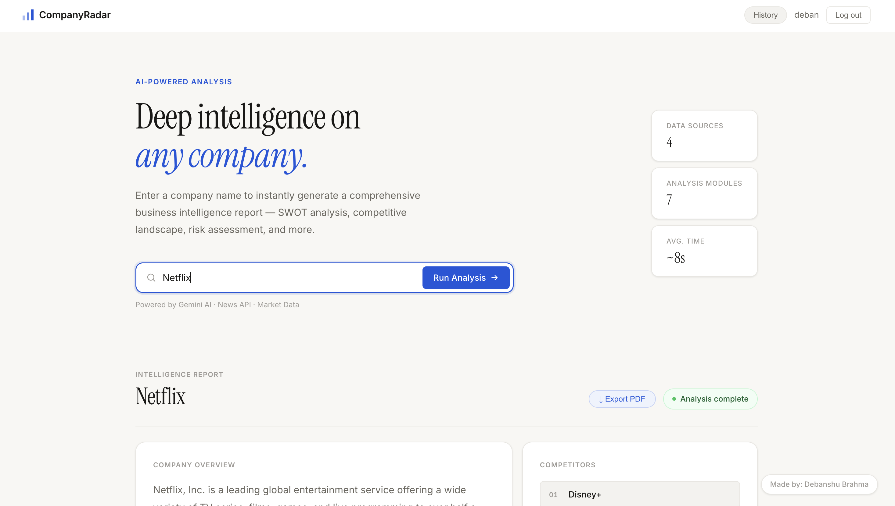
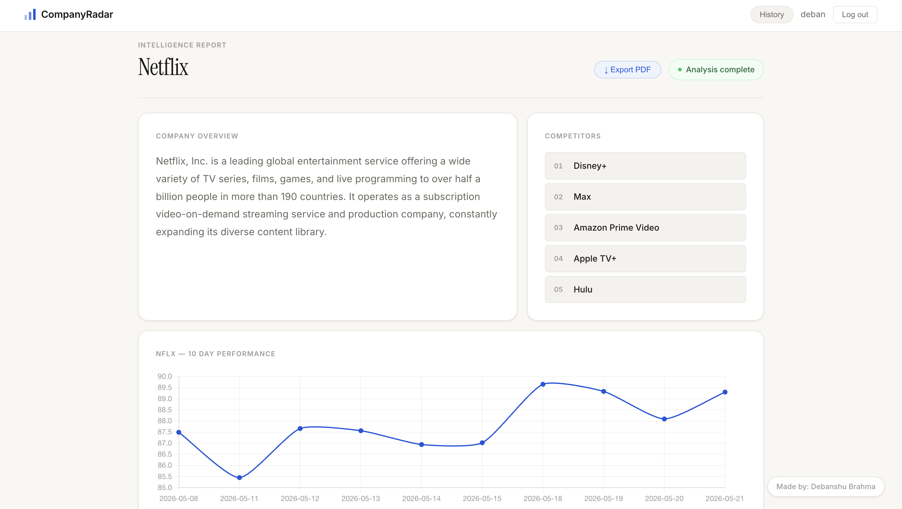
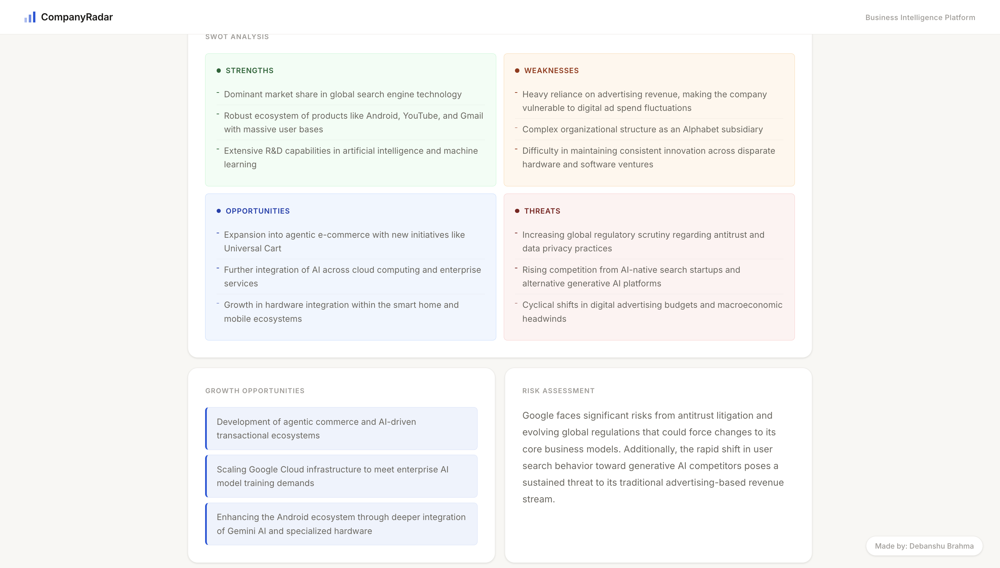

# CompanyRadar

A full-stack web app that generates instant business intelligence reports for any company — powered by Gemini AI.

**Live Demo:** https://companyradar.onrender.com

---

# What it does

Enter any company name and get a comprehensive BI report in ~8 seconds:

- **Company Summary** — concise overview
- **SWOT Analysis** — strengths, weaknesses, opportunities, threats
- **Competitor Map** — top direct competitors
- **Growth Opportunities** — AI-identified expansion areas
- **Risk Assessment** — key business risks
- **Stock Chart** — 10-day market performance (public companies)

---

# Tech Stack

| Layer | Technology |
|---|---|
| Frontend | HTML, CSS, JavaScript |
| Backend | Node.js, Express |
| AI | Google Gemini API |
| News | NewsAPI |
| Search | SerpAPI |
| Market Data | Twelve Data API |
| Deployment | Render |

---

# Screenshots:

