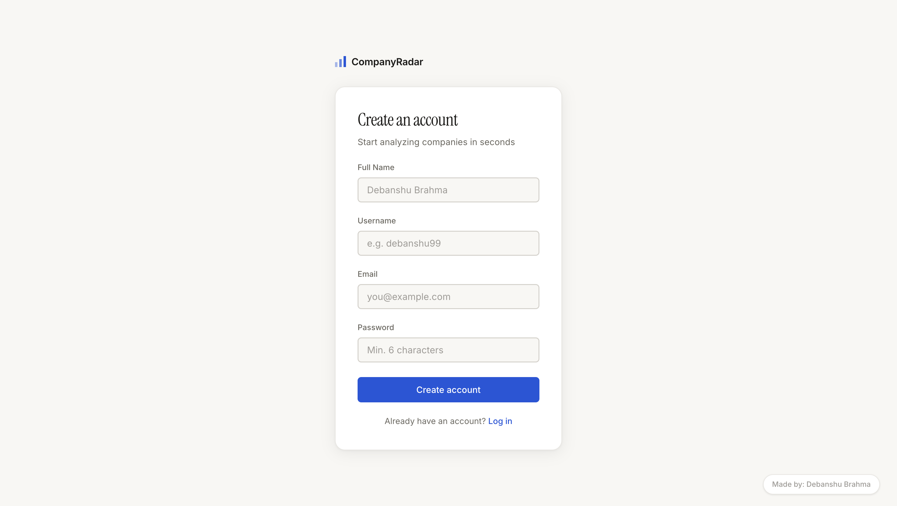
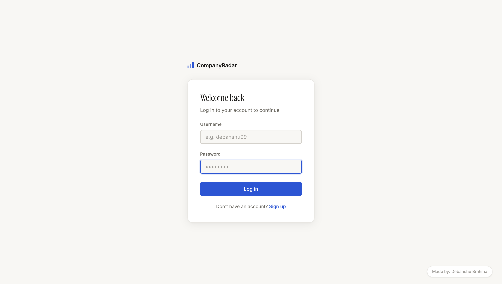
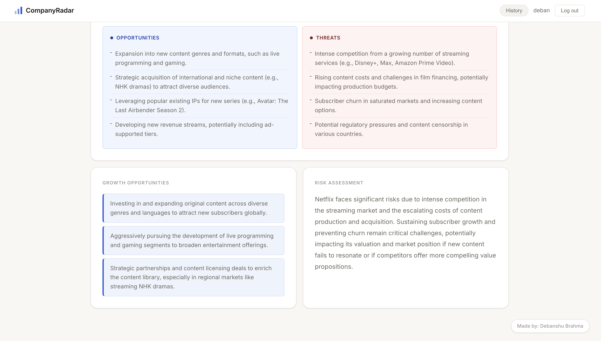

# CompanyRadar 
### AI-Powered Business Intelligence Platform

A full-stack web application that generates instant business intelligence reports for any company — powered by Gemini AI with secure user authentication.

**Live Demo:** https://companyradar.onrender.com

---

## What it does

Enter any company name and get a comprehensive BI report in ~8 seconds:

- **Company Summary** — concise overview
- **SWOT Analysis** — strengths, weaknesses, opportunities, threats
- **Competitor Map** — top direct competitors
- **Growth Opportunities** — AI-identified expansion areas
- **Risk Assessment** — key business risks
- **Stock Chart** — 10-day market performance (public companies)
- **Search History** — saved per user, with delete support
- **PDF Export** — download full report as PDF

---

## Features

- **JWT Authentication** — secure signup, login and protected routes
- **bcrypt Password Hashing** — passwords never stored as plain text
- **User Accounts** — each user has their own search history
- **Parallel API Fetching** — all data sources fetched simultaneously
- **AI Model Fallback** — automatically retries with backup Gemini models
- **Responsive Design** — works on mobile and desktop

---

## Tech Stack

| Layer | Technology |
|---|---|
| Frontend | HTML, CSS, JavaScript, Chart.js(for stock graphs) |
| Backend | Node.js, Express.js |
| Database | MongoDB Atlas, Mongoose |
| Authentication | JWT, bcryptjs |
| AI | Google Gemini AI |
| News | NewsAPI |
| Search | SerpAPI |
| Market Data | Twelve Data API |
| Deployment | Render |

---

## REST API Endpoints

| Method | Endpoint | Description | Auth |
|---|---|---|---|
| POST | /auth/signup | Create account | ❌ |
| POST | /auth/login | Login | ❌ |
| POST | /analyze | Generate BI report | ✅ |
| GET | /history | Get search history | ✅ |
| DELETE | /history/:id | Delete a search | ✅ |

---
## Run Locally

**Clone the repo:**
```bash
git clone https://github.com/debanshuu/CompanyRadar.git
cd CompanyRadar
npm install
```

**Create a `.env` file:**

```
MONGODB_URI=your_mongodb_uri
JWT_SECRET=your_jwt_secret
GEMINI_API_KEY=your_key
NEWS_API_KEY=your_key
SERP_API_KEY=your_key
TWELVE_DATA_API_KEY=your_key
```

**Run:**
```bash
node server.js
```

---
## Screenshots








---

Made by **Debanshu Brahma**
